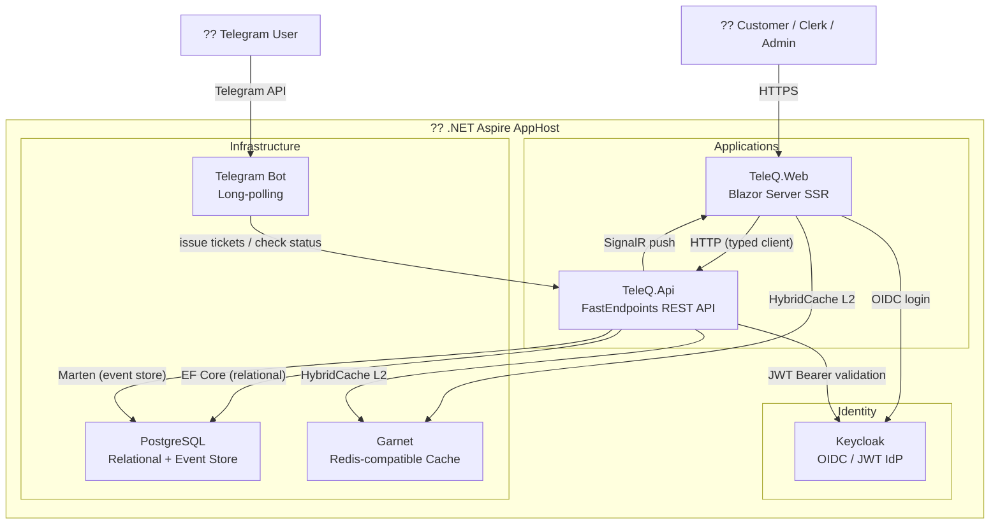

# TeleQ

A cloud-native, event-driven queue management system built with .NET 10 and .NET Aspire. TeleQ allows customers to book walk-in tickets or schedule appointments via a Telegram Bot or a Blazor web app, while clerks manage the live queue from a real-time dashboard powered by SignalR.

## Table of Contents

- [Architecture Overview](#architecture-overview)
- [Projects](#projects)
- [Key Features](#key-features)
- [Tech Stack](#tech-stack)
- [Getting Started](#getting-started)
- [Configuration](#configuration)
- [API](#api)
- [Roles & Authorization](#roles--authorization)

---

## Architecture Overview



- **TeleQ.Web** communicates with **TeleQ.Api** over HTTP using a typed `HttpClient`.
- **TeleQ.Api** uses **Entity Framework Core** for relational data (branches, services, time slots, assignments) and **Marten** (PostgreSQL event store) for the event-sourced `Ticket` aggregate.
- **Garnet** (Microsoft's Redis-compatible cache) is used as a distributed L2 cache in both the API and the Blazor frontend (HybridCache).
- **Keycloak** handles authentication and authorization via OpenID Connect / JWT Bearer.
- Real-time queue updates are pushed to clerks via **SignalR** (`QueueHub`).
- Customers can interact with the system via a **Telegram Bot** (long-polling).
---

## Projects

| Project | Path | Description |
|---|---|---|
| `TeleQ.AppHost` | `src/Aspire/TeleQ.AppHost` | .NET Aspire orchestrator — wires up all services and infrastructure containers |
| `TeleQ.ServiceDefaults` | `src/Aspire/TeleQ.ServiceDefaults` | Shared Aspire service defaults (health checks, telemetry, resilience) |
| `TeleQ.Api` | `src/Backend/TeleQ.Api` | Minimal API backend using FastEndpoints, versioned REST API + SignalR hub |
| `TeleQ.Web` | `src/Apps/TeleQ.Web` | Blazor Server (interactive SSR) frontend for admins, clerks, and customers |
| `TeleQ.Tests` | `src/Tests/TeleQ.Tests` | Test project using TUnit |

---

## Key Features

### Customer
- **Walk-in ticket** — Issue an instant queue ticket at a branch/service via the web or Telegram Bot.
- **Appointment booking** — Book a time-slotted appointment and receive a ticket number.
- **Ticket tracking** — Check queue position and ticket status in real time.
- **Reschedule / Cancel** — Modify or cancel an existing appointment.

### Clerk
- **Live queue dashboard** — View the current queue for their assigned branch/service with real-time updates via SignalR.
- **Call next** — Advance the queue by calling the next waiting ticket.
- **Serve / No-show** — Mark the current ticket as served or mark it as a no-show.

### Admin
- **Branch management** — Create, update, and deactivate branches.
- **Service management** — Define and manage services offered at branches.
- **Time slot management** — Configure available appointment slots per service.
- **Reports** — View daily queue statistics and ticket event logs for any date range.

### Telegram Bot
- Customers can register their phone number, select a branch and service, book walk-in tickets or appointments, and check their queue position entirely through the Telegram Bot.

---

## Tech Stack

| Layer | Technology |
|---|---|
| Runtime | .NET 10 |
| Orchestration | .NET Aspire |
| API Framework | FastEndpoints (with API versioning) |
| Frontend | Blazor Server (Interactive SSR) |
| Relational DB | PostgreSQL (via EF Core + Npgsql) |
| Event Store | Marten (PostgreSQL-backed) |
| Cache | Garnet (Redis-compatible) + HybridCache |
| Auth | Keycloak (OpenID Connect / JWT Bearer) |
| Real-time | SignalR (`/hubs/queue`) |
| Telegram | Telegram.Bot (long-polling) |
| API Docs | Scalar UI + OpenAPI |
| Testing | TUnit |

---

## Getting Started

### Prerequisites

- [.NET 10 SDK](https://dotnet.microsoft.com/download)
- [Docker Desktop](https://www.docker.com/products/docker-desktop/) (for Aspire infrastructure containers)

### Run with Aspire

```bash
dotnet run --project src/Aspire/TeleQ.AppHost
```

Aspire will automatically start and wire up all required containers:

| Service | Address |
|---|---|
| Blazor Web App | https://localhost (assigned by Aspire) |
| REST API | https://localhost (assigned by Aspire) |
| Keycloak | http://localhost:8081 |
| PgAdmin | http://localhost:5050 |
| Aspire Dashboard | http://localhost:15888 |

Database migrations are applied automatically on startup via the `api-migrations` resource.

---

## Configuration

### Telegram Bot (`appsettings.json` in `TeleQ.Api`)

```json
{
  "TelegramBot": {
    "Enabled": true,
    "BotToken": "<your-telegram-bot-token>"
  }
}
```

Set `Enabled` to `false` to disable the bot in environments where it is not needed.

### Keycloak

The AppHost imports a pre-configured realm from `src/Aspire/TeleQ.AppHost/Realms/teleq-realm.json`. It defines:
- Realm: `teleq`
- API client: `teleq-api` (JWT Bearer audience)
- Web client: `teleq-web` (OIDC authorization code flow)
- Roles: `admin`, `clerk`

The admin password for PostgreSQL, Keycloak, and Garnet is provided via the `Password` Aspire parameter (set in `appsettings.Development.json` or user secrets).

---

## API

The API is versioned (v1 / v2) and documented via the Scalar UI at:

```
/scalar/v1
/scalar/v2
```

The raw OpenAPI document is available at `/openapi/{version}.json`.

### Endpoint Groups

| Group | Base Route | Description |
|---|---|---|
| Branches | `/v1/branches` | CRUD for branches |
| Services | `/v1/services` | CRUD for services |
| Time Slots | `/v1/timeslots` | Manage appointment time slots |
| Tickets | `/v1/tickets` | Issue walk-in tickets, book/reschedule/cancel appointments |
| Queue | `/v1/queue` | Get queue, call next, serve, no-show, get position |
| Reports | `/v1/reports` | Daily stats, date range stats, ticket event log |

### SignalR Hub

| Endpoint | Description |
|---|---|
| `/hubs/queue` | Real-time queue updates; clients join groups by `branchId:serviceId` |

---

## Roles & Authorization

| Role | Permissions |
|---|---|
| `admin` | Full access — branch/service/time slot management, reports, queue operations |
| `clerk` | Queue dashboard, call next, serve, no-show |
| *(authenticated)* | Book/cancel/reschedule tickets, check own ticket status |
